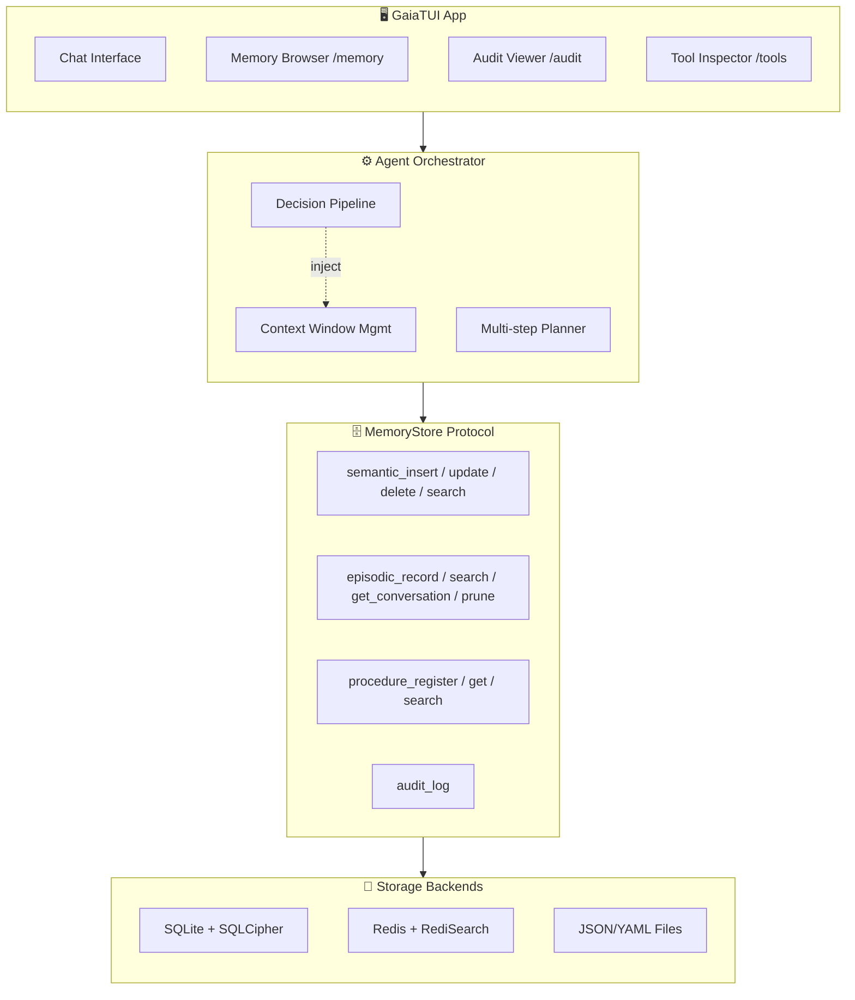
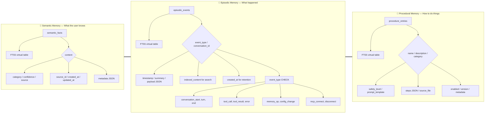
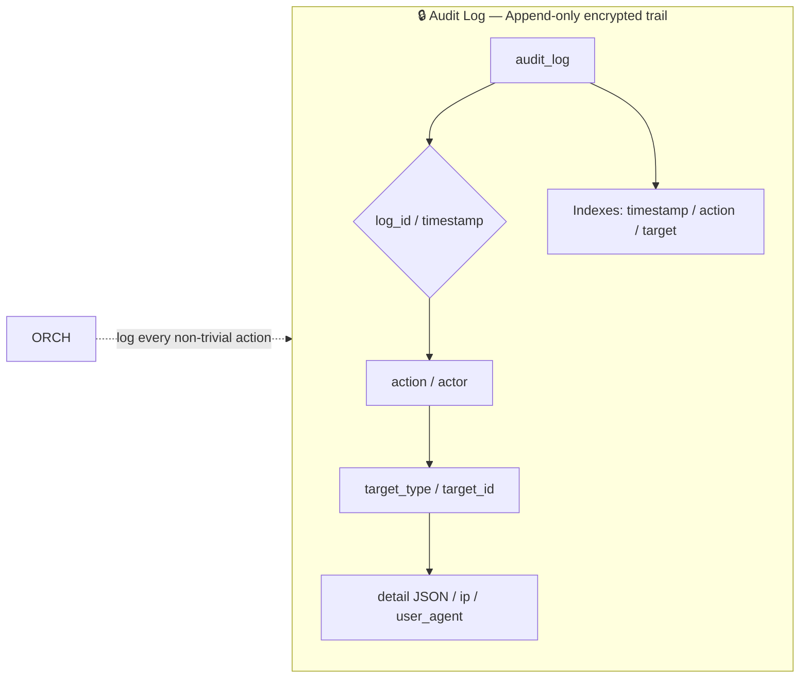

# G.A.I.A. Memory Architecture

> Privacy-first, local, modular — three memory types behind a single storage protocol.

---

## Top-Level Flow

---

## Memory Types

---

## Audit Log

---

## Memory Type Characteristics

| Memory Type | Purpose | Key Features | Storage |
|---|---|---|---|
| **🧠 Semantic** | What the user knows | Confidence scoring, autodistillation, source-tracked | SQLite + FTS5 |
| **📖 Episodic** | What happened | Time-indexed, full conversation transcripts, retention policy | SQLite + FTS5 |
| **🔧 Procedural** | How to do things | Safety-gated (safe/caution/danger), hot-reloadable | YAML/JSON on disk + SQLite index |
| **🔒 Audit Log** | Action trail (metadata only) | Append-only, encrypted, exportable as signed JSONL | SQLite table |

---

## Storage Backends

| Backend | Status | Search | Features |
|---|---|---|---|
| **🗃️ SQLiteMemoryStore** | v1 default | FTS5 virtual tables | SQLCipher encryption, ACID, zero external deps |
| **☁️ RedisMemoryStore** | Planned v2 | RediSearch + HNSW vectors | EXPIRE TTL for retention, multi-device sync |
| **📁 FileStore** | Dev / lightweight | grep/ripgrep fallback | Human-editable, git-versionable, no DB |
